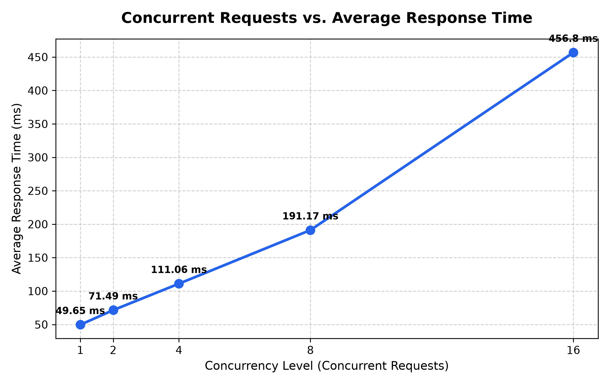
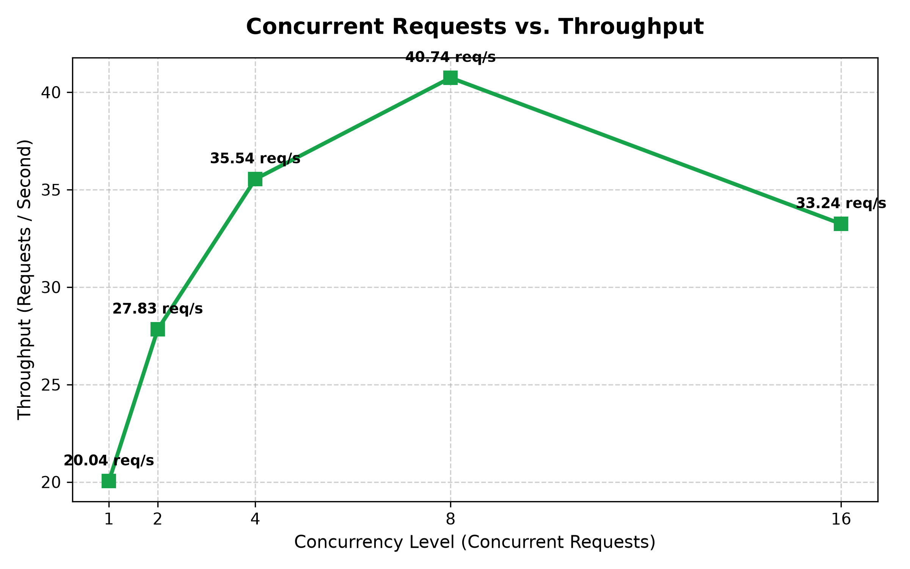
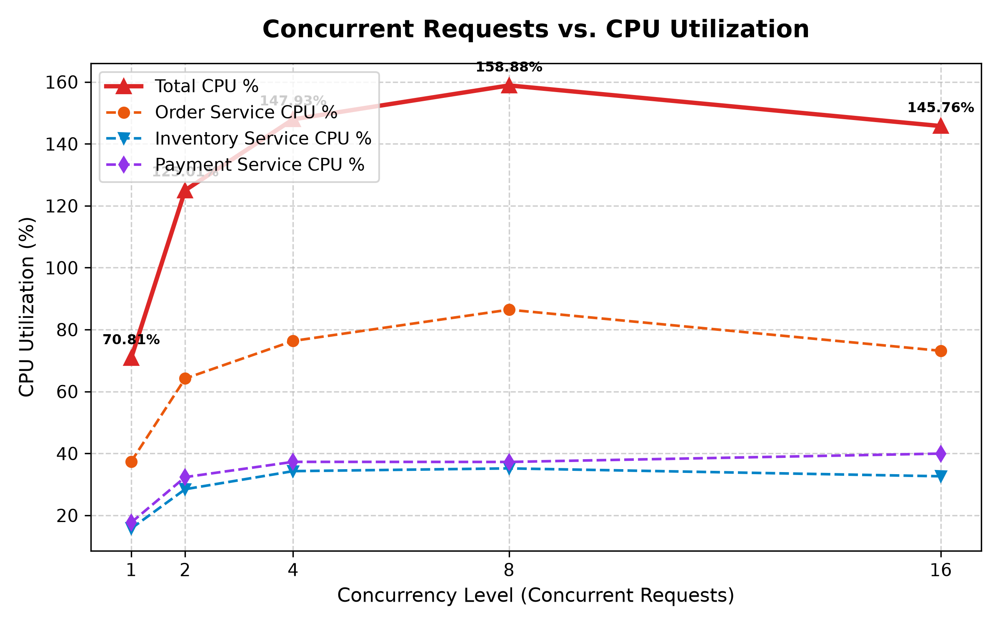
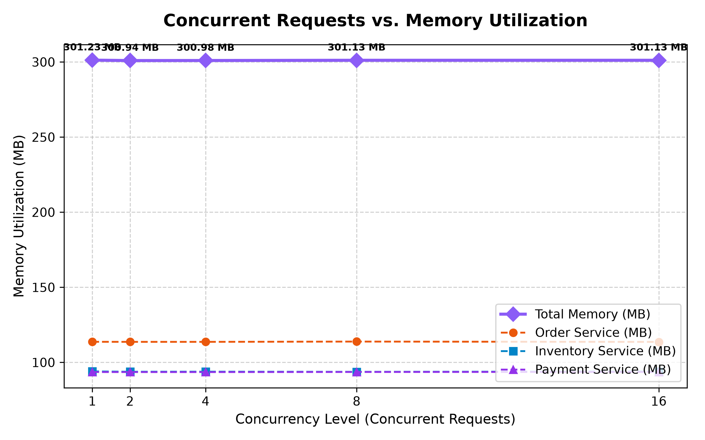
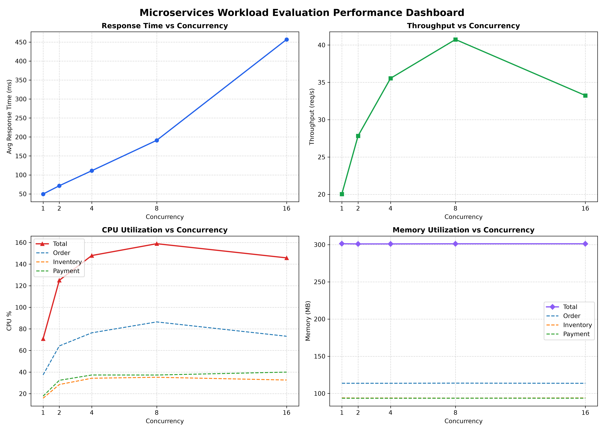

# Cloud Computing Lab - Evaluation 1
## Experiment: Build, Deploy and Analyze a Containerized Microservice Application Under Varying Workloads

**Student Name:** Akash N Raj  
**GitHub Account:** [akaraj187](https://github.com/akaraj187)  
**Repository:** [Microservices-Docker-Workload-Evaluation](https://github.com/akaraj187/Microservices-Docker-Workload-Evaluation)  
**Domain:** Online E-Commerce Shopping & Order Fulfillment System  

---

## 1. Aim and Overview
The objective of this laboratory experiment is to:
1. Design and develop a microservice-based architecture comprising **three independent services**.
2. Containerize each service using standalone **Dockerfiles** and deploy the multi-container system via **Docker Compose**.
3. Establish robust **inter-service communication** using internal Docker network DNS service discovery.
4. Generate varying workloads across five standardized concurrency levels ($W_1 = 1$, $W_2 = 2$, $W_3 = 4$, $W_4 = 8$, $W_5 = 16$).
5. Monitor and record real-time container resource utilization (`CPU %` and `Memory MB`) alongside application-level metrics (`Latency` and `Throughput`).
6. Analyze performance bottlenecks, resource consumption profiles, and scalability characteristics.

---

## 2. Architecture & Microservice Responsibilities

```
                                  +------------------------------------+
                                  |            Client / Tester         |
                                  +-----------------+------------------+
                                                    |
                                                    | HTTP POST /orders
                                                    v
                    +-----------------------------------------------------------------+
                    |                   Docker Bridge Network                         |
                    |                 (microservices-network)                         |
                    |                                                                 |
                    |   +---------------------------------------------------------+   |
                    |   |                 Order Service (Port 5000)               |   |
                    |   |  - API Gateway & Order Orchestrator                     |   |
                    |   |  - Persists order ledger in SQLite                      |   |
                    |   +-------------------+-----------------+-------------------+   |
                    |                       |                 |                       |
                    |   HTTP POST /reserve  |                 | HTTP POST /payments   |
                    |   (Internal DNS)      |                 | (Internal DNS)        |
                    |                       v                 v                       |
                    |   +-----------------------+         +-----------------------+   |
                    |   |   Inventory Service   |         |    Payment Service    |   |
                    |   |      (Port 5001)      |         |      (Port 5002)      |   |
                    |   |  - Stock catalog      |         |  - Cryptographic txn  |   |
                    |   |  - Unit pricing       |         |  - Billing receipt    |   |
                    |   +-----------------------+         +-----------------------+   |
                    +-----------------------------------------------------------------+
```

### Microservice Directory & Endpoints

| Service Name | Container Name | Host Port | Internal Port | Primary Responsibility | Key REST API Endpoints |
| :--- | :--- | :--- | :--- | :--- | :--- |
| **Order Service** | `order-service` | `5000` | `5000` | Order lifecycle orchestration, upstream coordination, transaction ledger | `GET /health`<br>`GET /orders`<br>`GET /orders/<id>`<br>`POST /orders` |
| **Inventory Service** | `inventory-service` | `5001` | `5001` | Product catalog maintenance, stock reservation, stock replenishment | `GET /health`<br>`GET /products`<br>`GET /products/<id>`<br>`POST /products/<id>/reserve`<br>`POST /products/<id>/restock` |
| **Payment Service** | `payment-service` | `5002` | `5002` | Payment verification, cryptographic signature hashing, transaction receipts | `GET /health`<br>`POST /payments`<br>`GET /payments/<id>` |

---

## 3. Checkpoint Execution & Verification

### Checkpoint 1 — Design and Develop the Microservices
- Each microservice is implemented as an independent Python Flask service with production-grade WSGI multi-threading via Gunicorn.
- Independent endpoints return structured JSON with status codes (`200 OK`, `201 Created`, `400 Bad Request`, `404 Not Found`).

### Checkpoint 2 — Containerize and Deploy the Application
- Each microservice contains an optimized multi-stage compatible `Dockerfile` based on `python:3.11-slim`.
- All services are integrated into `docker-compose.yml` with port forwardings and persistent restart policies.
- Build and deployment commands:
  ```bash
  # Build images
  docker compose build

  # Verify images created
  docker images | grep eval1

  # Start all services
  docker compose up -d

  # Check container status
  docker compose ps
  ```

### Checkpoint 3 — Inter-Service Communication
- Services communicate across a dedicated user-defined Docker bridge network (`microservices-network`).
- Service discovery operates through Docker's internal DNS using service names:
  - `http://inventory-service:5001`
  - `http://payment-service:5002`
- End-to-end transaction flow:
  1. Client sends `POST http://localhost:5000/orders`.
  2. Order Service performs validation and calls Inventory Service (`POST /products/<id>/reserve`).
  3. Upon stock reservation confirmation, Order Service calls Payment Service (`POST /payments`).
  4. Payment Service verifies amount, computes security auth token, and issues receipt.
  5. Order Service commits the finalized order record to its database and returns HTTP 201 with full transaction details to the client.
- Run the verification script:
  ```bash
  ./scripts/test_services.sh
  ```

---

## 4. Checkpoint 4 & 5 — Workload Testing & Performance Observations

### Workload Testing Setup
- Workload generator script: `scripts/workload_benchmark.py`
- Concurrent requests evaluated: **1, 2, 4, 8, 16 concurrent threads**
- Total requests per workload: **150 requests**
- Metric collection:
  - Application layer: Wall-clock latency (Average and 95th Percentile) and Throughput (Requests/sec).
  - Infrastructure layer: Real-time background `docker stats` streaming monitor capturing average CPU % and Memory (MB) for all three containers individually and combined.

### Measured Performance Observation Table

| Workload | Concurrency | Total Requests | Successful | Failed | Avg Latency (ms) | P95 Latency (ms) | Throughput (req/s) | Order Service CPU (%) | Inventory Service CPU (%) | Payment Service CPU (%) | Total System CPU (%) | Total System Memory (MB) |
| :---: | :---: | :---: | :---: | :---: | :---: | :---: | :---: | :---: | :---: | :---: | :---: | :---: |
| **W1** | **1** | 150 | 150 | 0 | **49.65** | 82.51 | **20.04** | 37.37% | 15.75% | 17.69% | **70.81%** | 301.23 MB |
| **W2** | **2** | 150 | 150 | 0 | **71.49** | 121.99 | **27.83** | 64.20% | 28.45% | 32.36% | **125.01%** | 300.94 MB |
| **W3** | **4** | 150 | 150 | 0 | **111.06** | 224.91 | **35.54** | 76.35% | 34.29% | 37.29% | **147.93%** | 300.98 MB |
| **W4** | **8** | 150 | 150 | 0 | **191.17** | 358.71 | **40.74** | 86.44% | 35.18% | 37.26% | **158.88%** | 301.13 MB |
| **W5** | **16** | 150 | 150 | 0 | **456.80** | 622.07 | **33.24** | 73.16% | 32.63% | 39.96% | **145.76%** | 301.13 MB |

---

## 5. Performance Graphs

### 1. Concurrent Requests vs. Average Response Time


### 2. Concurrent Requests vs. Throughput


### 3. Concurrent Requests vs. CPU Utilization


### 4. Concurrent Requests vs. Memory Utilization


### 5. Multi-Metric Evaluation Dashboard


---

## 6. Analysis & Discussion

### A. Impact of Increasing Concurrency on Response Time & Throughput
1. **Low-to-Medium Concurrency ($W_1$ to $W_4$):**
   - As concurrency scales from 1 to 8, throughput increases significantly from **20.04 req/s to 40.74 req/s** (a **+103% throughput improvement**).
   - This occurs because Gunicorn's multi-worker architecture concurrently processes requests and overlaps I/O wait times across container boundaries.
2. **High Concurrency Saturation Point ($W_4 \to W_5$):**
   - At 16 concurrent requests ($W_5$), the system reaches its resource ceiling: throughput drops from **40.74 req/s down to 33.24 req/s**, while average response time surges from **191.17 ms to 456.80 ms**.
   - This represents classic **thread pool exhaustion and socket contention**: requests spend more time queued waiting for available WSGI worker processes and database lock availability than in active computation.

### B. Microservice Resource Consumption Comparison
- **Order Service is the Primary Resource Consumer:**
  - Order Service consistently exhibited the highest CPU consumption across all tests (peaking at **86.44% CPU** in $W_4$, compared to ~35% for Inventory and ~37% for Payment).
  - *Rationale:* Order Service performs request deserialization, payload validation, manages two synchronous outbound HTTP connection lifecycles, computes response signatures, and serializes records into persistent storage.
- **Inventory & Payment Services:**
  - Maintained balanced, steady-state CPU utilization (~28%–39%), demonstrating efficient stateless endpoint handling.
- **Memory Stability:**
  - Memory consumption remained virtually flat across all workload tiers (~113.6 MB for Order Service, ~93.8 MB for Inventory Service, and ~93.5 MB for Payment Service).
  - This indicates **zero memory leaks** and stable garbage collection behavior under concurrent loads.

### C. Failure Analysis
- **Zero Request Failures Recorded:** All 750 requests across the five workload tiers completed with HTTP 201 Created and zero failed requests, proving the stability of container network bridging and retry timeouts.

---

## 7. How to Reproduce

### Prerequisites
- Docker Engine & Docker Compose (Works natively in Linux / WSL2)
- Python 3 with `matplotlib`

### Steps
```bash
# 1. Clone repository
git clone https://github.com/akaraj187/Microservices-Docker-Workload-Evaluation.git
cd Microservices-Docker-Workload-Evaluation

# 2. Build and launch containers
docker compose up -d --build

# 3. Verify services and run end-to-end inter-service test
./scripts/test_services.sh

# 4. Run automated workload benchmark and generate graphs
python3 scripts/workload_benchmark.py

# 5. Stop containers when done
docker compose down
```
